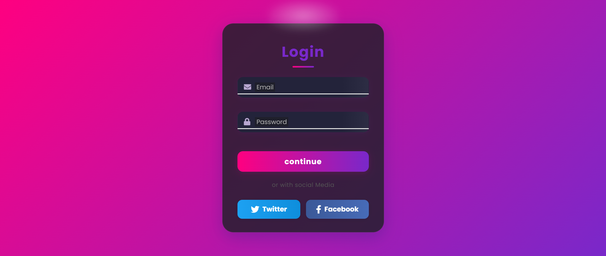

# Animated Login Form

A modern authentication UI with glassmorphism design, smooth animations, and vanilla HTML/CSS/JS — no frameworks or build tools.



---

> **Live Demo:** [mehdi-dev-sudo.github.io/Animated-Login-Form](https://mehdi-dev-sudo.github.io/Animated-Login-Form/)

---

## Pages

| Page | Path | Description |
|------|------|-------------|
| **Login / Sign Up** | `index.html` | Main auth form — switch between login and registration |
| **Forgot Password** | `forgot.html` | Email input → simulated reset link with success state |
| **Terms & Conditions** | `terms.html` | Styled terms page with staggered fade-in sections |
| **404** | `404.html` | Fallback page for missing routes |

## Features

### Auth Form (`index.html`)
- **Login & Signup** in one card with animated slide-out/slide-in transition
- **Glassmorphism card** with `backdrop-filter: blur()`, animated background orbs
- **Floating labels** — animate on focus / when input has a value
- **Form validation** — email regex, min-length, password match, error states with shake animation
- **Password strength indicator** — real-time scoring (Weak → Very Strong) with color-coded bar and label
- **Show/hide password** toggle on all password fields
- **Toast notifications** — auto-dismiss after 3s, click-to-dismiss, Escape to close all, max 3 visible, success/error variants with icons
- **Remember Me** — saves email/password to `localStorage`, restores on page load, removes on uncheck
- **Loading state** — spinner + disabled button during simulated API call
- **Auto-focus** first input on form switch
- **Avatar bounce animation** on form switch

### Forgot Password (`forgot.html`)
- Email input with validation
- Loading state on submit button
- Success message after simulated send (doesn't reveal if account exists — security best practice)
- Back-to-Login link

### Additional
- **Custom scrollbar** (WebKit)
- **Focus-visible** outline for keyboard navigation
- **Reduced motion** support via `prefers-reduced-motion`
- **Responsive** — mobile, tablet, desktop breakpoints
- **Print styles** — hides decorative orbs
- **SEO meta tags** — Open Graph, Twitter Card, theme-color, description
- **Accessibility** — `aria-label`, `aria-hidden`, `role="alert"`, `aria-live`, `autocorrect`/`autocapitalize`/`spellcheck` off on email/password
- **No-JS fallback** — `<noscript>` warning
- **Input limits** — `maxlength` on all fields

## Tech Stack

- **HTML5** — semantic markup
- **CSS3** — custom properties, flexbox, grid, animations, glassmorphism (`backdrop-filter`), media queries
- **Vanilla JavaScript** — ES5+ (IIFE, no polyfills needed)
- **Font Awesome 6** (Free) — icons
- **Google Fonts** — Inter

No Tailwind, no TypeScript, no Node.js, no dependencies.

## Quick Start

```bash
npx serve .
```

Open `http://localhost:3000`.

To serve on a specific port:

```bash
npx serve . -p 8080 -s
```

## Project Structure

```
├── index.html      # Login / Sign Up (main page)
├── forgot.html     # Forgot Password flow
├── terms.html      # Terms & Conditions
├── 404.html        # Not Found
├── style.css       # All styles (single file)
├── script.js       # All logic (single file)
└── screenshot.png.png
```

## Browser Support

Modern browsers with `backdrop-filter` support:
- Chrome/Edge 76+
- Firefox 103+
- Safari 9+
- Opera 64+

## Connect

<p align="center">
  <a href="mailto:mehdi.khorshidi9339@gmail.com"></a>
  <a href="https://github.com/Mehdi-dev-sudo"></a>
  <a href="https://t.me/Mehdi-dev-sudo"></a>
</p>

---

## License

MIT — see [LICENSE](LICENSE) for details.

---

<div align="center">
  <p>
    Built by <a href="https://github.com/Mehdi-dev-sudo">Mehdi Khorshidi far</a>
    &nbsp;·&nbsp;
    <a href="https://github.com/Mehdi-dev-sudo/Animated-Login-Form">GitHub</a>
    &nbsp;·&nbsp;
    Portfolio project — no frameworks, no shortcuts
  </p>
</div>
